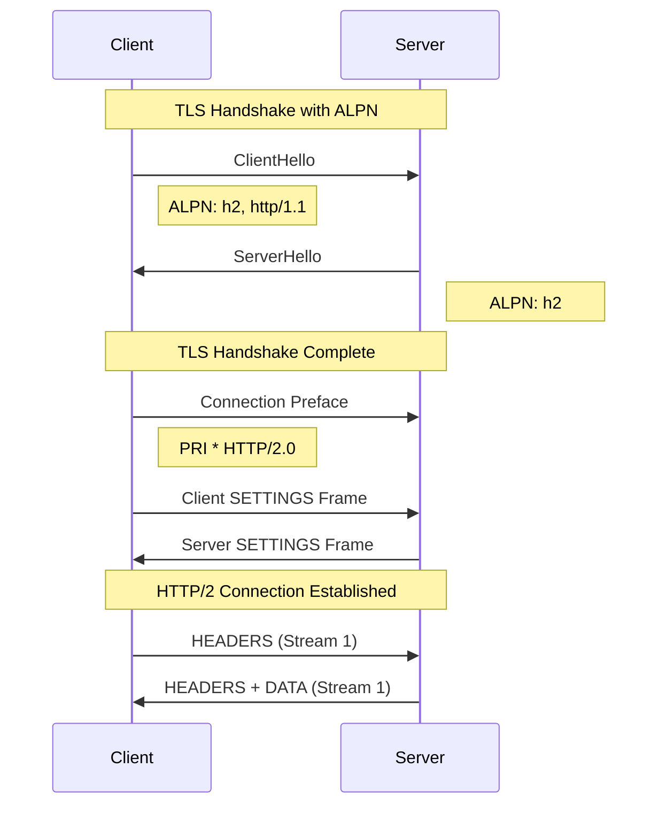
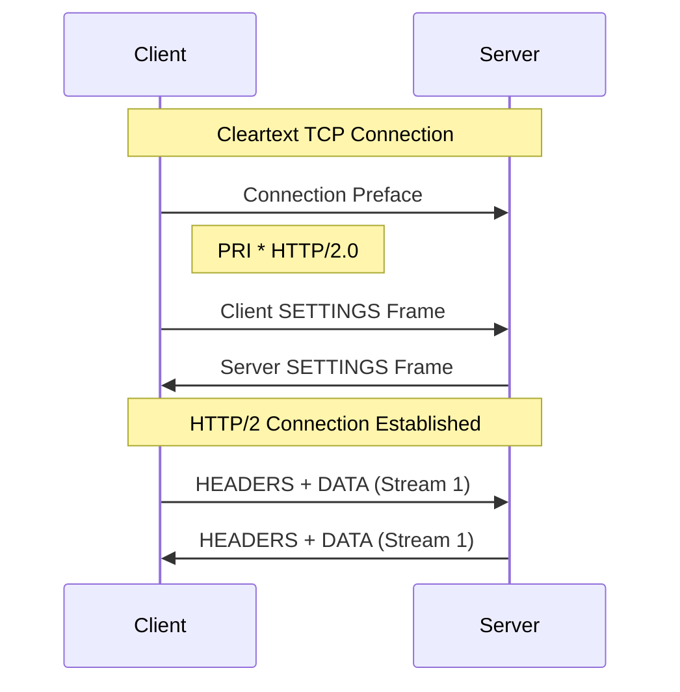
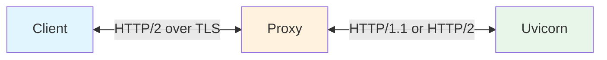

**Uvicorn** has experimental support for HTTP/2, built on the [`zttp`](https://zttp.marcelotryle.com/)
parser.

!!! warning "Experimental Feature"
    HTTP/2 support is currently **experimental** and is **not enabled by default**.

## Overview

HTTP/2 introduces several key features:

- **Multiplexing**: Multiple requests and responses can be sent simultaneously over a single TCP connection
- **Header compression**: HTTP headers are compressed using HPACK, reducing overhead
- **Binary protocol**: More efficient parsing compared to HTTP/1.1's text-based format

## Enabling HTTP/2

HTTP/2 support requires the `zttp` package:

```bash
pip install zttp
```

To enable it, select the `zttp` HTTP implementation:

=== "Command Line"
    ```bash
    uvicorn main:app --http zttp
    ```

=== "Programmatic"
    ```python
    import uvicorn

    uvicorn.run("main:app", http="zttp")
    ```

The `zttp` implementation serves both HTTP versions: each connection is dispatched to
HTTP/1.1 or HTTP/2 depending on what the client speaks. Two more variants pin a single
version:

| `--http` | Serves |
| --- | --- |
| `zttp` | HTTP/1.1 and HTTP/2 |
| `zttp1` | HTTP/1.1 only |
| `zttp2` | HTTP/2 only |

`zttp2` is useful when every client is known to speak HTTP/2, e.g. gRPC backends or
services behind a proxy configured for `h2c://` upstreams. Over TLS it advertises only
`h2` via ALPN, so clients that cannot speak HTTP/2 get no negotiated protocol and the
connection fails instead of falling back to HTTP/1.1.

## Connection Methods

### h2: HTTP/2 over TLS (Recommended)

When using HTTPS, HTTP/2 is negotiated via **ALPN** (Application-Layer Protocol Negotiation)
during the TLS handshake. This is the most common way to use HTTP/2, and the only one web
browsers support.



For testing it locally, you can generate a self-signed certificate:

```bash
openssl req -x509 -newkey rsa:2048 -keyout key.pem -out cert.pem -days 365 -nodes -subj "/CN=localhost"
```

Then create a simple ASGI application:

```python title="main.py"
async def app(scope, receive, send):
    await send({"type": "http.response.start", "status": 200, "headers": []})
    await send({"type": "http.response.body", "body": b"ok"})
```

Run Uvicorn with `--http zttp` and the SSL certificate files:

```bash
uvicorn main:app --http zttp --ssl-keyfile key.pem --ssl-certfile cert.pem
```

You can test the connection using curl (`-k` skips certificate verification for self-signed certs):

```bash
curl -v --http2 -k https://localhost:8000/
```

### h2c: HTTP/2 Cleartext with Prior Knowledge

On cleartext connections, Uvicorn accepts clients that speak HTTP/2 directly - known as
"prior knowledge" h2c. The client opens the connection with the HTTP/2 preface instead of an
HTTP/1.1 request, and Uvicorn switches protocols on the spot.



Using the same `main.py`:

```bash
uvicorn main:app --http zttp
```

```bash
curl -v --http2-prior-knowledge http://localhost:8000/
```

This is the mechanism proxies use for cleartext HTTP/2 upstreams, so HTTP/2 between a proxy
and Uvicorn works without TLS. How you enable it is proxy-specific: Traefik and Caddy use
`h2c://` upstream URLs, while Envoy configures HTTP/2 on the cluster.

!!! warning "h2c is cleartext"
    Prior-knowledge h2c provides no transport encryption or peer authentication. Limit it to
    trusted private networks (e.g. the proxy-to-Uvicorn hop); use HTTP/2 over TLS for any
    untrusted hop.

!!! warning
    The HTTP/1.1 `Upgrade: h2c` mechanism is **not** supported: an upgrade request is served
    as plain HTTP/1.1, which RFC 7540 explicitly allows. Browsers do not support h2c at all -
    they only speak HTTP/2 over TLS.

## ASGI Scope

When a request comes in over HTTP/2, the ASGI scope has `http_version` set to `"2"`:

```python
async def app(scope, receive, send):
    assert scope["type"] == "http"
    print(f"HTTP Version: {scope['http_version']}")  # "2" for HTTP/2
```

## Using with Reverse Proxies

In production, Uvicorn is typically deployed behind a reverse proxy like Nginx, Caddy, or HAProxy.
The proxy can terminate TLS and serve HTTP/2 to clients, while talking either HTTP/1.1 or
HTTP/2 to Uvicorn.



### Proxy HTTP/2 Upstream Support

**HTTP/2 upstream** refers to the protocol used between the proxy and Uvicorn. While all modern
proxies support HTTP/2 for client connections, support for HTTP/2 to backend servers varies.

**Multiplexing** is HTTP/2's ability to send multiple requests simultaneously over a single TCP
connection. Some proxies support HTTP/2 upstream but open a new connection per request, which
means they don't truly multiplex.

Here's the state of proxy support at the time of writing:

| Proxy | HTTP/2 Upstream | Multiplexing | Enabled by | Documentation |
|-------|-----------------|--------------|------------|---------------|
| **Envoy** | Yes | Yes | HTTP/2 protocol options on the cluster | [Connection Pooling Docs](https://www.envoyproxy.io/docs/envoy/latest/intro/arch_overview/upstream/connection_pooling) |
| **Caddy** | Yes | Yes | `h2c://` upstream (experimental), or `versions 2` in the transport for TLS | [reverse_proxy Docs](https://caddyserver.com/docs/caddyfile/directives/reverse_proxy) |
| **HAProxy** | Yes | Yes | `proto h2` on the server line (cleartext), `ssl alpn h2,http/1.1` (TLS) | [HTTP/2 Docs](https://www.haproxy.com/documentation/hapee/latest/load-balancing/protocols/http-2/) |
| **Traefik** | Yes | Yes | `h2c://` service URL | [ServersTransport Docs](https://doc.traefik.io/traefik/routing/services/) |
| **Apache** | Yes (2.4.19+) | No | `h2://` / `h2c://` in `ProxyPass` (no HTTP/1.1 fallback) | [mod_proxy_http2 Docs](https://httpd.apache.org/docs/current/mod/mod_proxy_http2.html) |
| **Nginx** | Yes (1.29.4+) | No | `proxy_http_version 2;` (requires `ngx_http_v2_module`) | [ngx_http_proxy_module Docs](https://nginx.org/en/docs/http/ngx_http_proxy_module.html#proxy_http_version) |

Uvicorn supports both upstream flavors: cleartext prior-knowledge h2c, and HTTP/2 over TLS
via ALPN when the proxy-to-Uvicorn hop uses TLS.

### Performance Considerations

HTTP/2 provides the most benefit when:

- **High latency connections**: Multiplexing reduces round-trip overhead
- **Many concurrent requests**: Multiple streams share a single connection
- **Large headers**: HPACK compression reduces header overhead

For internal, low-latency connections (like proxy to backend), HTTP/1.1 with keepalive often
performs comparably to HTTP/2. It is simpler to configure and debug, which is why it remains the
recommended default for most deployments.

## Current Limitations

The implementation is young, and some protocol features are not complete yet:

- HTTP/2 server push and `Expect: 100-continue` are not supported.
- WebSockets over HTTP/2 (RFC 8441 extended `CONNECT`) are not supported. With `--http zttp`,
  WebSocket connections still work - they are served over HTTP/1.1.
